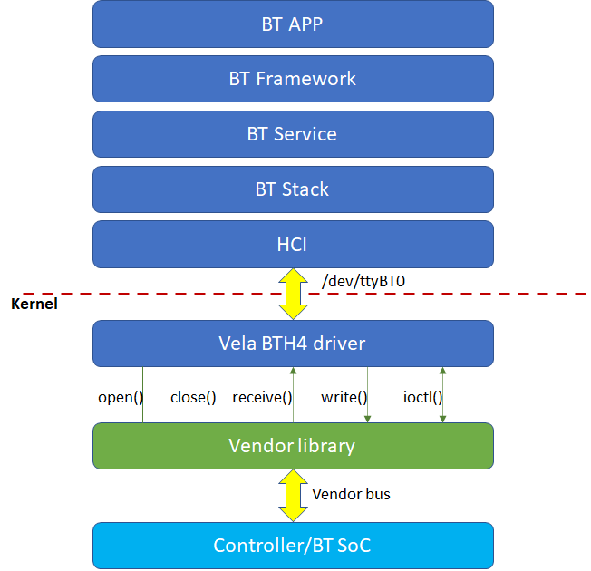

# Overview of openvela Bluetooth

\[ English | [简体中文](README_zh-cn.md) \]

## 1. Introduction to openvela Bluetooth

openvela Bluetooth has been certified for Bluetooth 5.4. It currently supports Bluetooth profiles listed as below:

- Core

  - BR/EDR/BLE
  - GAP
  - L2CAP
  - GATT Client/Server
- A2DP SRC/SNK
- AVRCP CT/TG
- HFP AG/HF
- PAN
- SPP
- HID
- HOGP
- LEA

  - TMAP
  - CAP
  - BAP/ASCS/PACS/BASS
  - CSIP/CSIS
  - MCP/MCS
  - CCP/TBS
  - VCP/VCS
- Mesh

openvela Bluetooth currently also supports a variety of open source and proprietary stacks such as Zephyr, Bluez, Bluedroid, Barrot, etc.

## 2. openvela Bluetooth Application Development

Third-party application developers may utilize the openvela QuickApp Feature to acquire system access capabilities.

Additionally, NDK interfaces are also provided to utilize all Bluetooth system-level capabilities. Please refer to header files in folder framework/include for more details.

## 3. openvela Bluetooth Driver Development

openvela Bluetooth supports multiple driver architectures. Taking the widely used BTH4 driver architecture as an example, chip manufacturers can implement a variable of the **struct bt_driver_s** structure type, and initialize the following member functions for it.

- CODE int (*open)(FAR struct bt_driver_s *btdev);
- CODE int (*send)(FAR struct bt_driver_s *btdev, enum bt_buf_type_e type, FAR void *data, size_t len);
- CODE int (*ioctl)(FAR struct bt_driver_s *btdev, int cmd, unsigned long arg);
- CODE void (*close)(FAR struct bt_driver_s *btdev);

The implementation of the above member functions depends on the specific type of HCI utilized, which refers to the physical bus linking the Host and the Controller.

Then, register the driver instance by passing the variable of the above structure type via the API bt_driver_register().

- int **bt_driver_register**(FAR struct bt_driver_s *drv);

Please refer to the type definition in header file nuttx/include/nuttx/wireless/bluetooth/bt_driver.h. The figure below helps to provide a comprehensive understanding of its functioning within the openvela OS.

Note: chip manufacturers are not required to implement the receive() member function, for it will be initialized by the BTH4 driver.

- CODE int (*receive)(FAR struct bt_driver_s *btdev, enum bt_buf_type_e type, FAR void *data, size_t len);

Upon receipt of HCI data from the chip, the vendor drivers should invoke the **bt_netdev_receive**() function, which in turn will trigger the receive() function to store the received HCI data.

